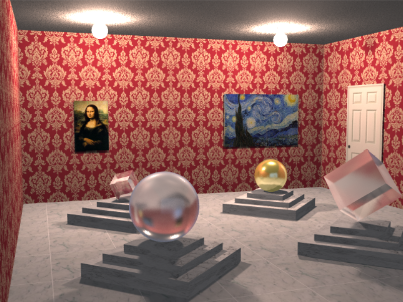
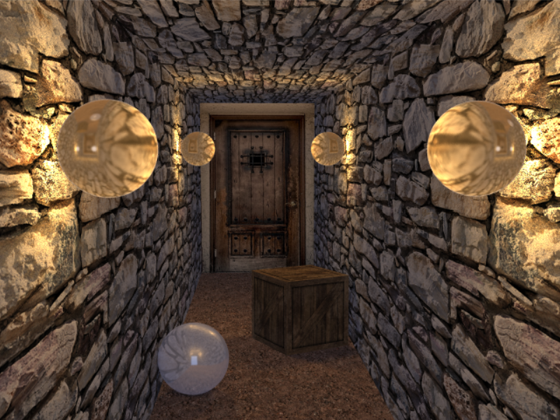
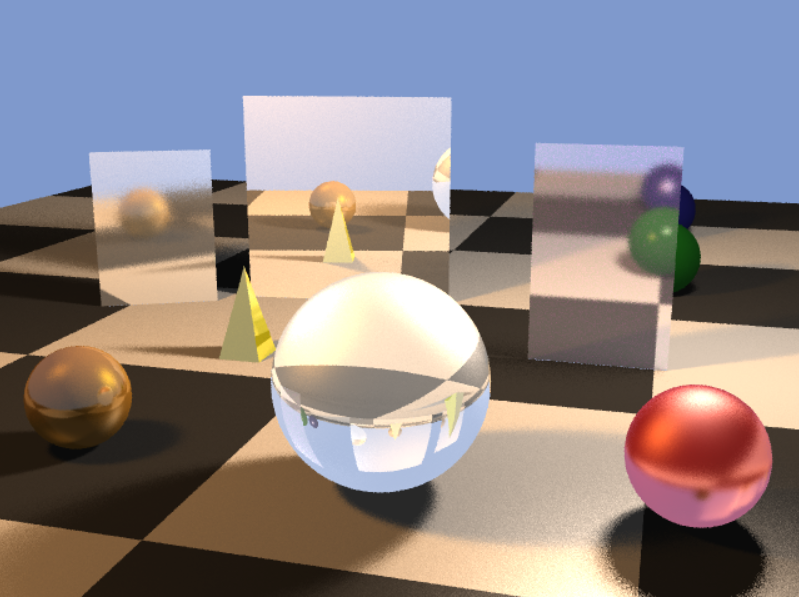
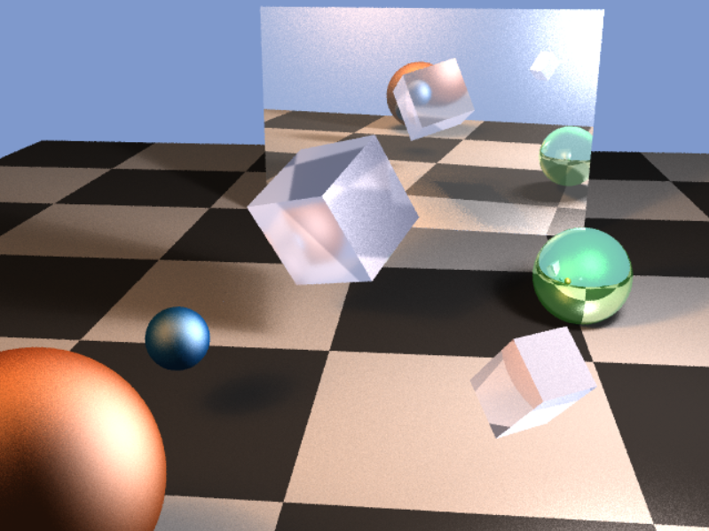

This is a ray tracer I built from scratch in C++. It implements some cool 
features such as soft shadows, glossy reflections and refractions, light 
attenuation, and texture mapping. I used a median split space partitioning 
algorithm for speed optimization.

Here are some cool renders I've done:

